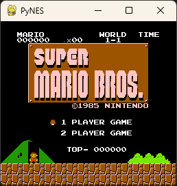

## PyNES

A Python implementation of the Nintendo Entertainment System (NES) emulator.

## Status

This project is still in its early stages of development. Currently, it can load and run NES ROMs, but there is still much work to be done. 

Due to Python, emulators can be very slow.

- CPU emulation (tested completely, but may have bugs?)
- PPU emulation (has bugs for rendering)
- Cartidge emulation (only implemented mapper0 for now)
- Controller input (only supports NES controller, and has bugs)
- Sound emulation (not implemented yet)

## Show
